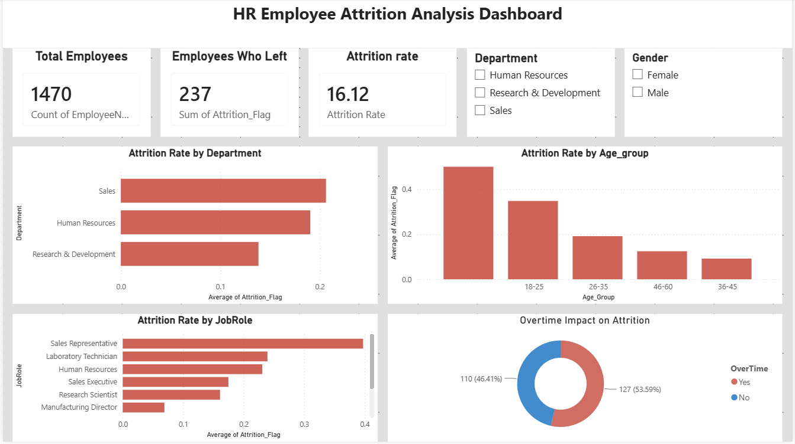
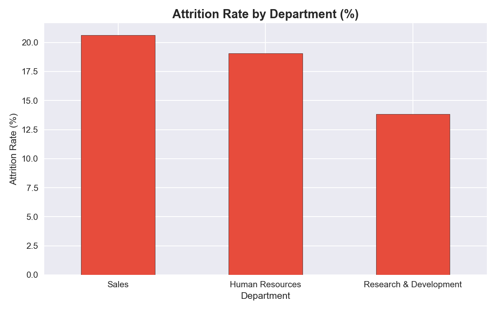
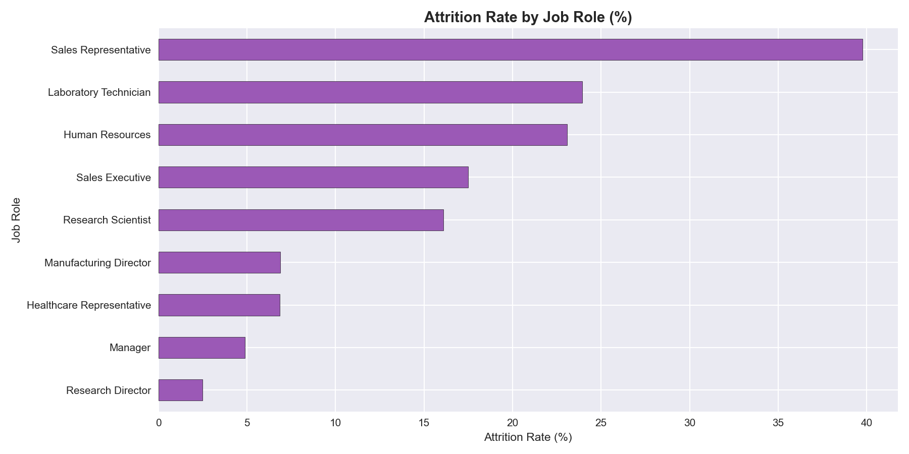
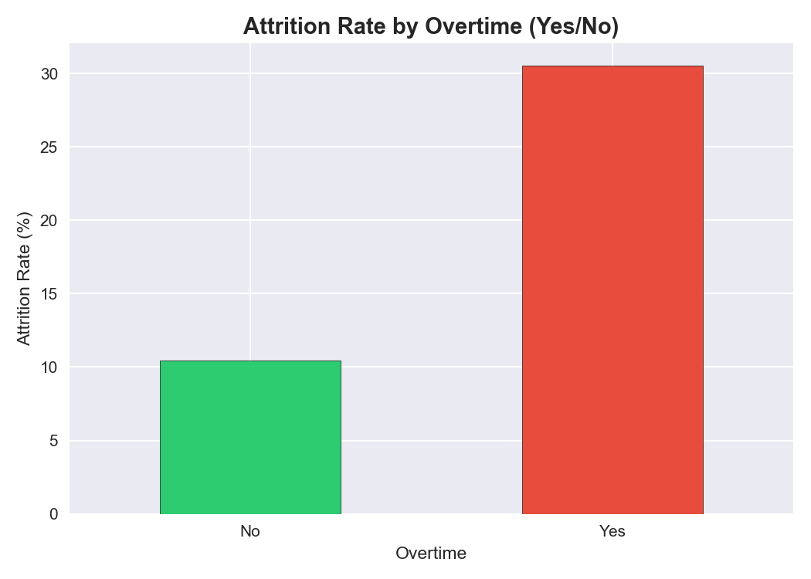
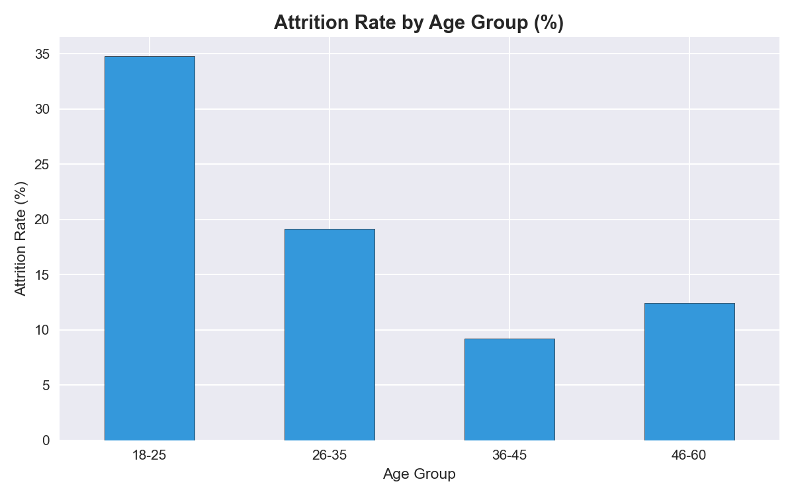

# 👥 HR Employee Attrition Analysis

## 📌 Project Overview
A leading organization was experiencing high employee turnover. 
This project analyzes IBM's HR dataset to identify the key drivers 
of attrition and provide actionable recommendations to help the 
HR team retain top talent.

---

## 🎯 Business Problem
> **"Why are employees leaving — and what can we do about it?"**

With an attrition rate of **16.1%** (above the industry average of 10-12%), 
the company needed data-driven insights to understand and reduce turnover.

---

## 📊 Key Findings

| Insight | Finding |
|---|---|
| 🚨 Overall Attrition Rate | 16.1% — above industry average |
| 🏢 Highest Risk Department | Sales (20.6%) |
| 💼 Highest Risk Job Role | Sales Representatives (39.8%) |
| ⏰ Overtime Impact | Overtime employees leave 3x more (30.5% vs 10.4%) |
| 👶 Age Risk | Youngest employees (18-25) leave the most (34.8%) |
| 💰 Income Gap | Employees who left earned $2,000 less on average |

---

## 💡 Business Recommendations

1. **Reduce overtime** — Implement strict overtime policies for Sales team
2. **Review Sales Rep compensation** — Nearly 1 in 2 Sales Reps are leaving
3. **Focus on young employees** — Create mentorship programs for 18-25 age group
4. **Salary review** — Address the income gap between staying and leaving employees
5. **Work-life balance** — Introduce flexible working for high-attrition departments

---

## 🛠️ Tools Used

---

## 📁 Project Structure

---

## 📈 Visualizations

### Attrition by Department

### Attrition by Job Role

### Overtime Impact

### Attrition by Age Group

---

## 🗄️ SQL Analysis
Key business questions answered using SQL:
- Overall attrition rate calculation
- Department-wise attrition breakdown
- Top 5 highest attrition job roles
- Overtime impact analysis
- Income comparison between stayed vs left
- High risk employee identification

---

## 📌 Dataset
- **Source:** IBM HR Analytics Employee Attrition & Performance
- **Platform:** Kaggle
- **Records:** 1,470 employees | 35 features

---

*Created by Priyanka M M | Bengaluru, India*
*Tools: Python • SQL • Power BI*
